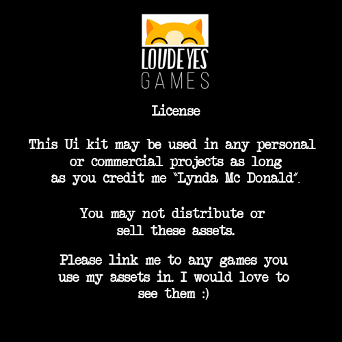

# Acknowledgements

Gameplay Design By Pranav SK - https://pranavsk.itch.io/
Music by Joseph Mohan - https://www.josephmohanmusic.com/film-game-music

Would like to thank the authors of the following articles:

1. https://lopespm.github.io/libraries/games/2018/12/27/camera-multi-target.html
2. https://catlikecoding.com/unity/tutorials
3. https://cyangamedev.wordpress.com/2020/01/03/toon-glass-shader-breakdown/

The code and assets in this project have used, either in parts or whole, content with the following licenses.

1. https://github.com/ArchonInteractive/SwissArmyLib
    

    
MIT License

    Copyright (c) 2017 archoninteractive

    Permission is hereby granted, free of charge, to any person obtaining a copy
    of this software and associated documentation files (the "Software"), to deal
    in the Software without restriction, including without limitation the rights
    to use, copy, modify, merge, publish, distribute, sublicense, and/or sell
    copies of the Software, and to permit persons to whom the Software is
    furnished to do so, subject to the following conditions:

    The above copyright notice and this permission notice shall be included in all
    copies or substantial portions of the Software.

    THE SOFTWARE IS PROVIDED "AS IS", WITHOUT WARRANTY OF ANY KIND, EXPRESS OR
    IMPLIED, INCLUDING BUT NOT LIMITED TO THE WARRANTIES OF MERCHANTABILITY,
    FITNESS FOR A PARTICULAR PURPOSE AND NONINFRINGEMENT. IN NO EVENT SHALL THE
    AUTHORS OR COPYRIGHT HOLDERS BE LIABLE FOR ANY CLAIM, DAMAGES OR OTHER
    LIABILITY, WHETHER IN AN ACTION OF CONTRACT, TORT OR OTHERWISE, ARISING FROM,
    OUT OF OR IN CONNECTION WITH THE SOFTWARE OR THE USE OR OTHER DEALINGS IN THE
    SOFTWARE.
    

2. https://loudeyes.itch.io/paper-ui-pack-for-games
    

    
License

    
    

3. https://quaternius.itch.io/lowpoly-robot [CC0 License](https://creativecommons.org/publicdomain/zero/1.0/)

3. ["360 Sphere Robot"](https://skfb.ly/6V8Rz) by mikeramos is licensed under Creative Commons Attribution (http://creativecommons.org/licenses/by/4.0/).

3. 
Icons made by <a href="https://icon54.com/" title="Pixel perfect">Pixel perfect</a> from <a href="https://www.flaticon.com/" title="Flaticon">www.flaticon.com</a>

5. https://www.kenney.nl/

Also Used the following Assets Store products: 

1. DoTween Pro - http://dotween.demigiant.com/